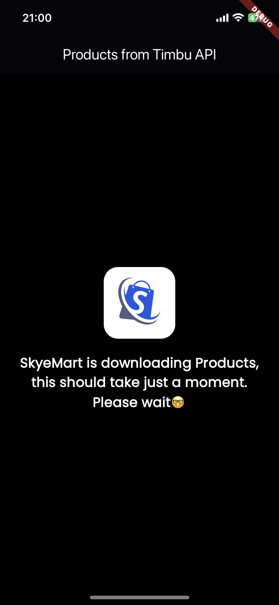

# SKYEMART

An elegant Flutter application to display products fetched from API endpoints. The app showcases product images, names, prices, and descriptions in an expandable card format.

## Table of Contents
- Features
- Screenshots
- Download
- Getting Started

## Features

- Fetch and display products from an API 
- Expandable cards to show detailed product information 
- Responsive and user-friendly UI


## Screenshots




## Download

You can download the app from the link below:

[Download SKYEMART here](https://www.mediafire.com/file/8po1ijqoe5toz1o/skyemart.apk/file)

## Getting Started

To clone and run this application, you'll need [Git](https://git-scm.com) and [Flutter](https://flutter.dev/docs/get-started/install) installed on your computer. From your command line:

```bash
# Clone this repository
$ git clone https://github.com/Nannoy/skyemart

# Go into the repository
$ cd YOUR_REPOSITORY_NAME

# Install dependencies
$ flutter pub get

# Run the app
$ flutter run
